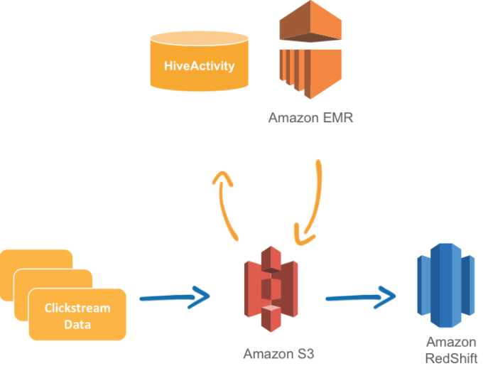

WORK IN PROGRESS
=====================

Data Pipeline Samples
=====================
AWS Data Pipeline is a web service that you can use to automate the movement and transformation of data. With AWS Data Pipeline, you can define data-driven workflows, so that tasks can be dependent on the successful completion of previous tasks. You define the parameters of your data transformations and AWS Data Pipeline enforces the logic that you've set up.
